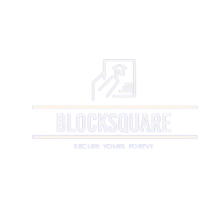
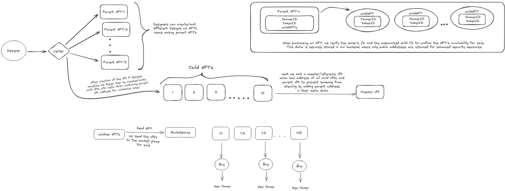

# Block Square Platform
<p>&nbsp;</p>
<p align="center">

</p>
<p>&nbsp;</p>

## Project Description

The Block Square platform addresses the challenges faced by the conveyance of property by leveraging blockchain technology and NFTs (Non-Fungible Tokens) to offer virtual land ownership. Participants can acquire NFTs representing parcels of virtual land within a designated "Mainland." These parcels, known as Child NFTs, are created and managed through smart contracts. The platform enables users to buy, sell, and develop their virtual properties, fostering a secure and transparent ecosystem for building a digital legacy.

## project video link

[Click here to watch the video](https://youtu.be/46jFsF0_SgY)

## Table of Contents

- [Getting Started](#getting-started)
- [Project Idea](#project-idea)
- [How to Use the Project](#how-to-use-the-project)
- [Credits](#credits)
- [How to Contribute to the Project](#how-to-contribute-to-the-project)
- [Helpful Links](#helpful-links)

## Getting Started

To get started with the development server, follow these steps:

1. **Install dependencies:**

   ```bash
   npm i
   ```

2. **Run the development server:**

   ```bash
   npm run dev
   ```

   or

   ```bash
   yarn dev
   ```

3. **Open http://localhost:3000 with your browser** to see the result.

## Project Idea

### ✅ Challenges with cw721 for Child NFTs

The cw721 standard, commonly used for creating NFTs on the Cosmos blockchain, presents a challenge for our specific use case. If we were to mint child NFTs directly using cw721 and link them to parent NFTs by referencing the parent's address, anyone could potentially mint a child NFT by simply including the parent's address in their transaction. This would compromise the integrity of the parent-child relationship and potentially lead to unwanted or unauthorized child NFTs.

### Proposed Solution: Reference NFT

To address the cw721 limitation, we propose introducing a new NFT type: a reference NFT. This reference NFT would act as a bridge between the parent and child NFTs. Here's how it would work:

- Minting Process:

  - A parent NFT is minted using the standard cw721 protocol.
  - A separate reference NFT is minted. This NFT stores the addresses of both the parent and child NFTs.
  - A child NFT is minted using cw721.

- Establishing the Relationship:

  - During the minting process of the child NFT, the transaction must include a reference to the corresponding reference NFT.
  - The reference NFT acts as a gatekeeper, ensuring only authorized child NFTs with a valid reference can be linked to the parent.

- Removing Unwanted Children:
  - Since the reference NFT holds the addresses of both parent and child, it can be used to manage the relationship.
  - If a child NFT needs to be removed (deemed unwanted or unauthorized), the reference NFT can be updated to remove the association with that specific child NFT address.

### Benefits of the Reference NFT Approach

- Security: Prevents unauthorized creation of child NFTs by requiring a valid reference during the minting process.

- Flexibility: Allows for future additions of child NFTs as long as they can be linked to a valid reference NFT.
- Transparency: The reference NFT provides a clear record of the parent-child relationships on the blockchain.

### ✅ Additional Feature: Multiple Virtual Land Parcels Submission and NFT Creation

### Challenge:

In implementing the feature allowing owners to submit multiple virtual land parcels for NFT creation, we encountered a challenge ensuring the availability and authenticity of the NFTs for sale.

### Solution:

To address this challenge, we implemented a verification process during NFT purchases. We validate both the owner's ID and the associated child ID to confirm the NFT's availability for sale. This verification step adds an extra layer of security and ensures that only legitimate NFTs are available for purchase.

---

<p>&nbsp;</p>
<p align="center">

</p>
<p>&nbsp;</p>

---

## How to Use the Project

1. **Submitting Virtual Land Parcels:**

   - Landowners can submit their virtual land parcels to the platform by navigating to the submission section in the user dashboard.
   - They will need to provide necessary details such as title, description, and upload the land parcel data.

2. **Creating NFTs:**

   - Once a land parcel is submitted, the platform automatically creates an NFT associated with the parcel.
   - The NFT represents ownership and authenticity of the virtual land.

3. **Product Creation:**

   - The platform uses the submitted land parcel data to create a range of products such as virtual properties, buildings, and more.
   - Users can browse through the virtual land catalog and select parcels they wish to purchase or develop.

4. **Purchasing NFT Shares:**

   - Users interested in supporting virtual land development can purchase shares in the NFT associated with a specific land parcel.
   - This gives them ownership rights to a portion of the NFT and a stake in the future development and sales of the associated virtual land.

## Credits

This project utilizes the following ADOs from AndromedaOs:

- [Timelock](https://docs.andromedaprotocol.io/andromeda/andromeda-digital-objects/timelock)
- [Splitter](https://docs.andromedaprotocol.io/andromeda/andromeda-digital-objects/splitter)
- [CW721](https://docs.andromedaprotocol.io/andromeda/andromeda-digital-objects/cw721)
- [Marketplace](https://docs.andromedaprotocol.io/andromeda/andromeda-digital-objects/marketplace)
- [CW20](https://docs.andromedaprotocol.io/andromeda/andromeda-digital-objects/cw20)

## How to Contribute to the Project

### Clone the repository

    git clone https://github.com/abhi8960git/AssetTrade-Dapp.git

### Navigate to the project directory

    cd AssetTrade-Dapp

### Install dependencies

    npm i

### Create a new branch for your feature or fix

    git checkout -b feature/new-feature

### Make your changes to the code

### Add your changes to the staging area

    git add .

### Commit your changes

    git commit -m "Add new feature or fix"

### Push your changes to your fork

    git push origin feature/new-feature

### Create a pull request on the GitHub repository

---

## Helpful links

[AndromedaOs Docs](https://docs.andromedaprotocol.io/andromeda) <br>
[AndromedaOs Web Application Docs](https://docs.andromedaprotocol.io/guides)
